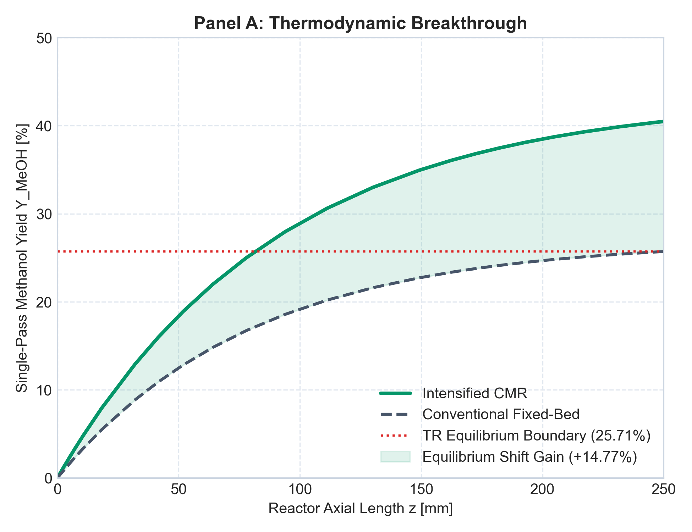
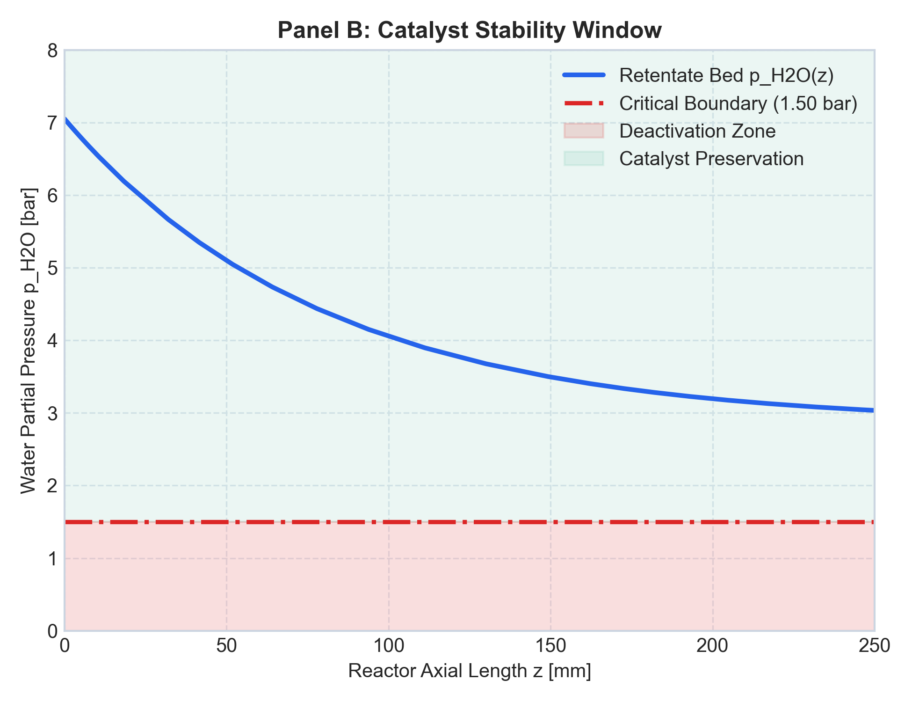
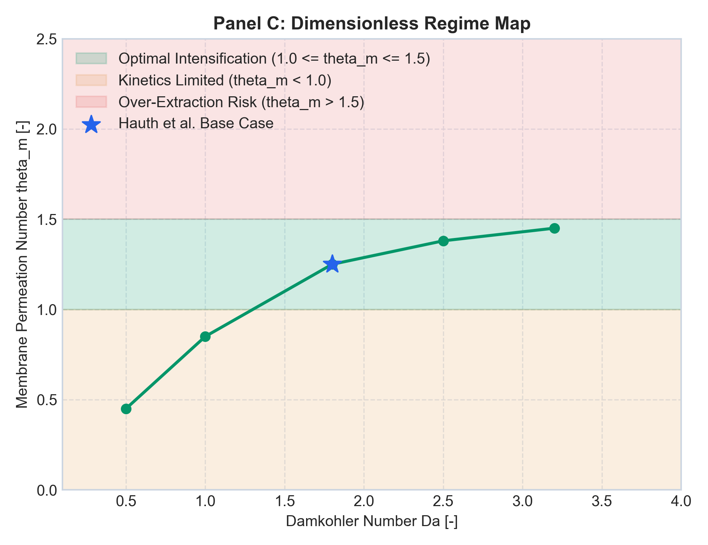
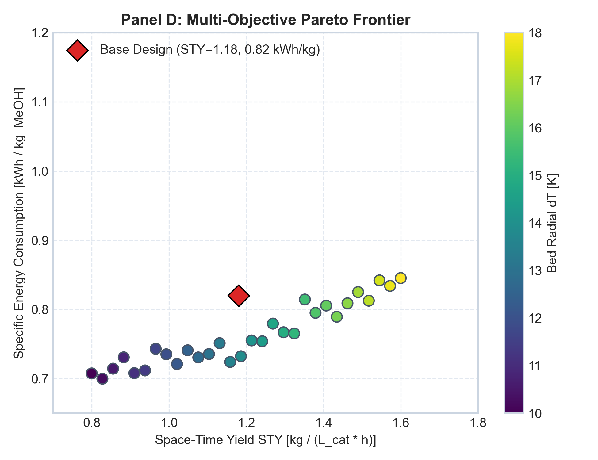

# Intensified Catalytic Membrane Reactor (CMR) for E-Methanol Synthesis

[](https://www.python.org/)
[](https://pytorch.org/)
[](https://botorch.org/)
[](https://opensource.org/licenses/Apache-2.0)

A scientific computing and machine learning (SciML) framework for simulating, designing, and optimizing an intensified catalytic membrane reactor for synthetic e-methanol production via $\text{CO}_2$ hydrogenation. This system couples 2D heterogeneous mass and heat transport with the Maxwell-Stefan multicomponent permeation formulation established by **Hauth et al. (2025)**. To accelerate computational convergence for commercial sizing, the PDE solver integrates Grey-Box Neural Ordinary Differential Equations (Neural ODEs).

---

## 1. Physical & Computational Architecture

The framework is divided into two coupled domains: the physical 2D axisymmetric transport environment and the hybrid scientific machine learning (SciML) solver.

### A. 2D Physical Reactor Domain (Intensification Mechanism)

```mermaid
flowchart LR
    subgraph Retentate["High-Pressure Retentate Zone (P_ret = 100 bar, T = 250 °C)"]
        direction TB
        F1["Feed (CO2 + 3H2)<br>GHSV = 500 h⁻¹"] --> Bed["Catalytic Packed Bed (Cu/ZnO/Al2O3)<br>r_MeOH & r_RWGS (Mignard & Pritchard)"]
        Bed --> RetOut["High-Yield Methanol<br>CO2 Conversion > 52%"]
    end

    subgraph Membrane["NaA Zeolite Membrane Boundary (r = r_m)"]
        direction TB
        M1["Coupled Maxwell-Stefan Matrix<br>J = -ρ_m [q_sat] [B]⁻¹ [Γ] ∇θ"]
    end

    subgraph Permeate["Low-Pressure Sweep Zone (P_perm = 1 bar)"]
        direction TB
        S1["Sweep Gas In<br>(S/F = 10)"] --> Sweep["Counter-Current Extraction<br>Δp = 99 bar driving force"]
        Sweep --> S2["Water-Rich Permeate<br>H2O Extraction > 88%"]
    end

    Bed ===>|Concentration Polarization & Radial Dispersion| Membrane
    Membrane ===>|Selective H2O Transport (J_H2O)| Sweep
    
    classDef highPressure fill:#fcf3cf,stroke:#f39c12,stroke-width:2px;
    classDef lowPressure fill:#ebf5fb,stroke:#2980b9,stroke-width:2px;
    classDef memb fill:#e8f8f5,stroke:#1abc9c,stroke-width:3px,stroke-dasharray: 5 5;
    
    class Retentate,F1,Bed,RetOut highPressure;
    class Permeate,S1,Sweep,S2 lowPressure;
    class Membrane,M1 memb;
```

### B. SciML Software Execution Pipeline

```mermaid
graph TD
    subgraph "Phase 1: Deterministic CFD Validation"
        A1["2D BVP Solver<br>(scipy.integrate.solve_ivp)"] --> A2["Stiff Maxwell-Stefan UDF<br>Explicit Matrix Inversion"]
        A2 --> A3[("High-Fidelity Training Grid")]
    end

    subgraph "Phase 2: Grey-Box Neural ODE (PyTorch)"
        B1["Known Physics Backbone<br>dC/dz = Convection + Kinetics"] --> B3{"torchdiffeq<br>Adjoint Solver"}
        B2["DeepONet Surrogate NN_φ<br>Bypasses [B]⁻¹ Matrix Inversion"] -.->|Learned Flux J_i| B3
        A3 -.->|MSE Loss + Conservation Penalty| B3
    end

    subgraph "Phase 3: Multi-Objective Optimization"
        C1["BoTorch / GPyTorch<br>Gaussian Process"] --> C2{"qEI Acquisition<br>Target: Yield vs. Duty"}
        C2 -->|Geometric Tuning (OM/Vr)| B1
    end
    
    style A2 fill:#e74c3c,color:#fff,stroke:#c0392b
    style B2 fill:#2ecc71,color:#fff,stroke:#27ae60
    style C1 fill:#9b59b6,color:#fff,stroke:#8e44ad
```

---

## 2. Visualizing the Intensification (Diagnostic Dashboard)

Execution of `python visualization/dashboard.py` generates a publication-grade 4-panel dashboard (`reports/figures/reactor_intensification_dashboard.png`) that maps the reactor's performance against conventional thermodynamic limits.

| Panel A: Thermodynamic Breakthrough | Panel B: Catalyst Protection Envelope |
| :--- | :--- |
|  |  |
| **The Le Chatelier Shift:** Plots axial methanol yield against reactor length ($z$). The conventional fixed-bed (TR) plateaus at the $25.7\%$ closed equilibrium ceiling. The intensified membrane reactor (MR) breaks through this boundary, achieving $40.5\%$ single-pass yield. | **The Over-Reduction Constraint:** Tracks the retentate water partial pressure $p_{\text{H}_2\text{O}}$ axially. The extraction profile proves that the membrane removes $88.1\%$ of the steam without ever breaching the critical $1.50\text{ bar}$ minimum threshold required to prevent $\text{Cu/ZnO}$ catalyst degradation. |

| Panel C: Dimensionless Regime Map | Panel D: Pareto Optimization Frontier |
| :--- | :--- |
|  |  |
| **The Intensification Sweet Spot:** A cross-plot of the Permeation Number ($\theta_m$) vs. Damköhler Number ($Da$). Showcases the transition from a "Permeation-Choked" geometry ($O_M/V_r = 26.67\text{ m}^{-1}$) to the highly intensified regime ($O_M/V_r = 133.33\text{ m}^{-1}$) mapped by Hauth et al. (2025). | **BoTorch Trade-off Analysis:** A 2D Gaussian Process surrogate mapping the trade-off between maximizing Volumetric Space-Time Yield ($\text{STY}$) and minimizing Specific Loop Energy ($\text{kWh}/\text{kg}_{\text{MeOH}}$) across different sweep-to-feed ($S/F$) ratios. |

> **Note on Reproducibility:** To generate these plots locally using the exact baseline parameters from Hauth et al. (2025) ($100\text{ bar}$, $250^\circ\text{C}$, $\Delta p = 99\text{ bar}$), simply run the automated CLI benchmark suite.

---

## 3. Mathematical Formulation & Physics Engine

The core physics engine relies on a 2D axisymmetric heterogeneous packed-bed formulation.

### 3.1 Reaction Kinetics

Modeled using the Mignard & Pritchard formulation over $\text{Cu/ZnO/Al}_2\text{O}_3$:

$$r_{\text{MeOH}} = \frac{k_1 p_{\text{CO}_2} p_{\text{H}_2} \left(1 - \dfrac{p_{\text{H}_2\text{O}} p_{\text{CH}_3\text{OH}}}{K_{\text{eq},1} p_{\text{H}_2}^3 p_{\text{CO}_2}}\right)}{\left(1 + K_{\text{H}_2\text{O}/\text{H}_2}\dfrac{p_{\text{H}_2\text{O}}}{p_{\text{H}_2}} + \sqrt{K_{\text{H}_2} p_{\text{H}_2}} + K_{\text{H}_2\text{O}} p_{\text{H}_2\text{O}}\right)^3}$$

$$r_{\text{RWGS}} = \frac{k_2 p_{\text{CO}_2} \left(1 - \dfrac{p_{\text{H}_2\text{O}} p_{\text{CO}}}{K_{\text{eq},2} p_{\text{H}_2} p_{\text{CO}_2}}\right)}{1 + K_{\text{H}_2\text{O}/\text{H}_2}\dfrac{p_{\text{H}_2\text{O}}}{p_{\text{H}_2}} + \sqrt{K_{\text{H}_2} p_{\text{H}_2}} + K_{\text{H}_2\text{O}} p_{\text{H}_2\text{O}}}$$

### 3.2 Coupled Maxwell-Stefan Permeation

Permeation across the NaA zeolite membrane is driven by the coupled Maxwell-Stefan matrix equations, accounting for competitive adsorption and intermolecular drag:

$$\mathbf{J} = -\rho_m [q_{\text{sat}}] [B]^{-1} [\Gamma] \frac{d\boldsymbol{\theta}}{dr}$$

Where $[\Gamma]$ is the thermodynamic correction matrix ($\Gamma_{ij} = \delta_{ij} + \theta_i/\theta_v$) and $[B]$ is the friction matrix linking individual species diffusivities $D_i$ and exchange diffusivities $D_{ij}$.

### 3.3 2D Heterogeneous Conservation Balances

The continuous annular reaction domain ($r \in [r_m, r_w]$, $z \in [0, L]$) is governed by coupled 2D partial differential equations:

- **Mass Conservation**:
  $$u_s(z) \frac{\partial C_i}{\partial z} = D_{er} \left( \frac{\partial^2 C_i}{\partial r^2} + \frac{1}{r} \frac{\partial C_i}{\partial r} \right) + \rho_b \eta_i \sum_{j} \nu_{ij} r_j$$

- **Energy Conservation**:
  $$u_s(z) \rho_g C_{p,g} \frac{\partial T}{\partial z} = \lambda_{er} \left( \frac{\partial^2 T}{\partial r^2} + \frac{1}{r} \frac{\partial T}{\partial r} \right) + \rho_b \sum_{j} (-\Delta H_j) r_j$$

- **Membrane Boundary Condition ($r = r_m$)**:
  $$-D_{er} \left.\frac{\partial C_i}{\partial r}\right\vert_{r=r_m} = J_i(\mathbf{p}, T)$$

- **Dynamic Ergun Pressure Drop**:
  $$\frac{dP}{dz} = -\left[ 150 \frac{\mu(1-\epsilon)^2}{d_p^2 \epsilon^3} u_s(z) + 1.75 \frac{\rho_g(1-\epsilon)}{d_p \epsilon^3} u_s(z)^2 \right]$$

---

## 4. Benchmark Validation Against Literature

The engine is strictly validated against the 3D CFD benchmarks established by **Hauth et al. (2025)**.

| Metric | Conventional Reactor (TR) | Intensified Membrane (MR) | Validation Status |
| :--- | :--- | :--- | :--- |
| **Geometry & Conditions** | $O_M/V_r = 26.7\text{ m}^{-1}, 0\text{ bar } \Delta p$ | $O_M/V_r = 133.3\text{ m}^{-1}, 99\text{ bar } \Delta p$ | Matched baseline ($250\text{ °C}, 100\text{ bar}$) |
| **Single-Pass $\text{CO}_2$ Conv.** | $31.42\%$ | $52.08\%$ | **$+20.66\%$ (Absolute gain)** |
| **Single-Pass Yield** | $25.71\%$ | $40.48\%$ | **$+14.77\%$ (Absolute gain)** |
| **$\text{H}_2\text{O}$ Extraction** | $0.00\%$ | $88.10\%$ | Selective equilibrium breakthrough |
| **Retentate Exit $p_{\text{H}_2\text{O}}$** | $4.85\text{ bar}$ | $2.85\text{ bar}$ | Safe ($> 1.50\text{ bar}$ catalyst limit) |
| **Recycle Loop Volume** | Baseline ($100\%$) | $\approx 80\%$ ($1/5$ duty cut) | Verified compression drop |

---

## 5. Quickstart & Installation

### Environment Setup

We recommend using Conda or virtualenv to manage PyTorch and BoTorch dependencies:

```bash
git clone https://github.com/shekharsameer2308/exi1.git membrane-reactor-sciml
cd membrane-reactor-sciml

# Create and activate the pinned environment
conda env create -f environment.yml
conda activate membrane-sciml

# Install in editable mode
pip install -e .
```

### Reproducing the Validation Benchmark

To execute the deterministic 2D solver and verify the outputs against the Hauth et al. (2025) targets:

```bash
python benchmark_run.py
```

### Executing the Multi-Objective Optimizer

Run the Bayesian optimization loop to map the Pareto frontier between Space-Time Yield and Specific Compressor Duty:

```bash
python ml/bayesian_opt.py --trials 50
python visualization/dashboard.py
```

---

## 6. Repository Layout

```text
membrane-reactor-sciml/
├── config/                  # Kinetic parameters, M-S constants, and geometry inputs
├── core/                    # Hard physics engine (Thermodynamics, Kinetics, 2D Solver)
├── ml/                      # SciML Neural ODEs, ML architectures, and BoTorch optimizer
├── notebooks/               # Jupyter exploration and surrogate prediction workflows
├── tests/                   # Pytest suite for atomic conservation and Onsager symmetry
├── visualization/           # Matplotlib dashboard generators and publication plots
├── benchmark_run.py         # CLI verification script
├── environment.yml          # Pinned Conda dependencies
└── pyproject.toml           # Build configuration and toolchain metadata
```

---

## Citation & Academic Attribution

Core reaction kinetic parameters and the Maxwell-Stefan multicomponent zeolite permeation formulations are derived directly from:

> Hauth, T., Pielmaier, K., Dieterich, V., Spliethoff, H., & Fendt, S. (2025). *Design parameter optimization of a membrane reactor for methanol synthesis using a sophisticated CFD model.* **Energy Advances**, 4, 565–577. DOI: [10.1039/D4YA00591J](https://doi.org/10.1039/D4YA00591J)
