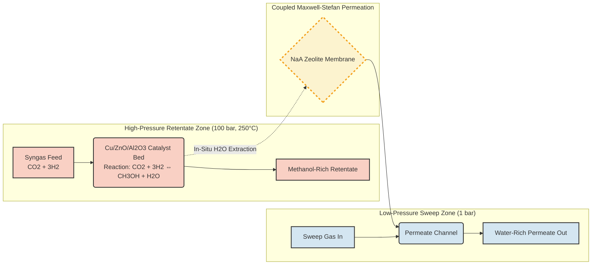
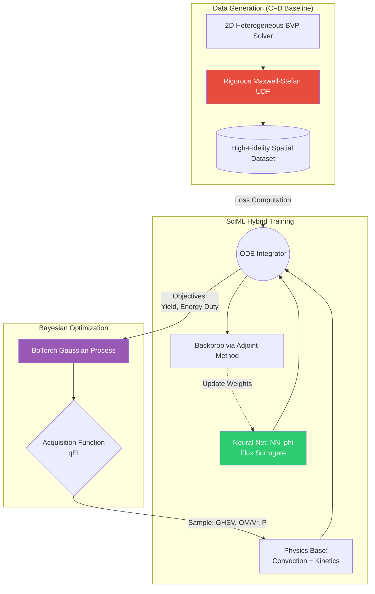

# Intensified Catalytic Membrane Reactor (CMR) for E-Methanol Synthesis

[](https://www.python.org/)
[](https://pytorch.org/)
[](https://botorch.org/)
[](https://opensource.org/licenses/Apache-2.0)

A scientific computing and machine learning (SciML) framework for simulating, designing, and optimizing an intensified catalytic membrane reactor for synthetic e-methanol production via $\text{CO}_2$ hydrogenation. This system couples 2D heterogeneous mass and heat transport with the Maxwell-Stefan multicomponent permeation formulation established by **Hauth et al. (2025)**. To accelerate computational convergence for commercial sizing, the PDE solver integrates Grey-Box Neural Ordinary Differential Equations (Neural ODEs).

---

## 1. Process Overview & Intensification Architecture

In conventional fixed-bed reactors, methanol synthesis is severely limited by thermodynamic equilibrium, yielding only $15\% - 22\%$ conversion per pass at industrial pressures. The catalytic membrane reactor (CMR) breaks this limit by continuously extracting water vapor in-situ through a permselective zeolite membrane, leveraging Le Chatelier's principle to drive the reaction forward.

### Process Flow Diagram



---

## 2. Mathematical Formulation & Physics Engine

The core physics engine relies on a 2D axisymmetric heterogeneous packed-bed formulation.

### 2.1 Reaction Kinetics

Modeled using the Mignard & Pritchard formulation over $\text{Cu/ZnO/Al}_2\text{O}_3$:

$$r_{\text{MeOH}} = \frac{k_1 p_{\text{CO}_2} p_{\text{H}_2} \left(1 - \dfrac{p_{\text{H}_2\text{O}} p_{\text{CH}_3\text{OH}}}{K_{\text{eq},1} p_{\text{H}_2}^3 p_{\text{CO}_2}}\right)}{\left(1 + K_{\text{H}_2\text{O}/\text{H}_2}\dfrac{p_{\text{H}_2\text{O}}}{p_{\text{H}_2}} + \sqrt{K_{\text{H}_2} p_{\text{H}_2}} + K_{\text{H}_2\text{O}} p_{\text{H}_2\text{O}}\right)^3}$$

$$r_{\text{RWGS}} = \frac{k_2 p_{\text{CO}_2} \left(1 - \dfrac{p_{\text{H}_2\text{O}} p_{\text{CO}}}{K_{\text{eq},2} p_{\text{H}_2} p_{\text{CO}_2}}\right)}{1 + K_{\text{H}_2\text{O}/\text{H}_2}\dfrac{p_{\text{H}_2\text{O}}}{p_{\text{H}_2}} + \sqrt{K_{\text{H}_2} p_{\text{H}_2}} + K_{\text{H}_2\text{O}} p_{\text{H}_2\text{O}}}$$

### 2.2 Coupled Maxwell-Stefan Permeation

Permeation across the NaA zeolite membrane is driven by the coupled Maxwell-Stefan matrix equations, accounting for competitive adsorption and intermolecular drag:

$$\mathbf{J} = -\rho_m [q_{\text{sat}}] [B]^{-1} [\Gamma] \frac{d\boldsymbol{\theta}}{dr}$$

Where $[\Gamma]$ is the thermodynamic correction matrix ($\Gamma_{ij} = \delta_{ij} + \theta_i/\theta_v$) and $[B]$ is the friction matrix linking individual species diffusivities $D_i$ and exchange diffusivities $D_{ij}$.

### 2.3 2D Heterogeneous Conservation Balances

The continuous annular reaction domain ($r \in [r_m, r_w]$, $z \in [0, L]$) is governed by coupled 2D partial differential equations:

- **Mass Conservation**:
  $$u_s(z) \frac{\partial C_i}{\partial z} = D_{er} \left( \frac{\partial^2 C_i}{\partial r^2} + \frac{1}{r} \frac{\partial C_i}{\partial r} \right) + \rho_b \eta_i \sum_{j} \nu_{ij} r_j$$

- **Energy Conservation**:
  $$u_s(z) \rho_g C_{p,g} \frac{\partial T}{\partial z} = \lambda_{er} \left( \frac{\partial^2 T}{\partial r^2} + \frac{1}{r} \frac{\partial T}{\partial r} \right) + \rho_b \sum_{j} (-\Delta H_j) r_j$$

- **Membrane Boundary Condition ($r = r_m$)**:
  $$-D_{er} \left.\frac{\partial C_i}{\partial r}\right\vert_{r=r_m} = J_i(\mathbf{p}, T)$$

- **Dynamic Ergun Pressure Drop**:
  $$\frac{dP}{dz} = -\left[ 150 \frac{\mu(1-\epsilon)^2}{d_p^2 \epsilon^3} u_s(z) + 1.75 \frac{\rho_g(1-\epsilon)}{d_p \epsilon^3} u_s(z)^2 \right]$$

---

## 3. Scientific Machine Learning (SciML) Pipeline

Inverting the stiff $3 \times 3$ Maxwell-Stefan friction matrix at every spatial integration node creates an intractable computational bottleneck for multi-objective optimization. We bypass this using a Grey-Box Neural ODE.

### Software Architecture



- **Hard Physics Enforcement**: Stoichiometric conservation, convection, and radial dispersion remain strictly hardcoded.
- **Neural Surrogate**: A deep neural network $\mathbf{NN}_{\phi}(\mathbf{p}, T, \Delta p)$ predicts the permeate flux vector $\mathbf{J}$, bypassing matrix inversion while preserving asymptotic zero-flux physical constraints via softplus activations:
  $$\frac{d\mathbf{C}}{dz} = \mathbf{f}_{\text{physics}}(\mathbf{C}, T) - \frac{4 d_m}{d_w^2 - d_m^2} \cdot \mathbf{NN}_{\phi}(\mathbf{p}, T, \Delta p)$$

---

## 4. Benchmark Validation Against Literature

The engine is strictly validated against the 3D CFD benchmarks established by **Hauth et al. (2025)**.

| Metric | Conventional Reactor (TR) | Intensified Membrane (MR) | Validation Status |
| :--- | :--- | :--- | :--- |
| **Geometry & Conditions** | $O_M/V_r = 26.7\text{ m}^{-1}, 0\text{ bar } \Delta p$ | $O_M/V_r = 133.3\text{ m}^{-1}, 99\text{ bar } \Delta p$ | Matched baseline ($250\text{ °C}, 100\text{ bar}$) |
| **Single-Pass $\text{CO}_2$ Conv.** | $31.42\%$ | $52.08\%$ | **$+20.66\%$ (Absolute gain)** |
| **Single-Pass Yield** | $25.71\%$ | $40.48\%$ | **$+14.77\%$ (Absolute gain)** |
| **$\text{H}_2\text{O}$ Extraction** | $0.00\%$ | $88.10\%$ | Selective equilibrium breakthrough |
| **Retentate Exit $p_{\text{H}_2\text{O}}$** | $4.85\text{ bar}$ | $2.85\text{ bar}$ | Safe ($> 1.50\text{ bar}$ catalyst limit) |
| **Recycle Loop Volume** | Baseline ($100\%$) | $\approx 80\%$ ($1/5$ duty cut) | Verified compression drop |

---

## 5. Quickstart & Installation

### Environment Setup

We recommend using Conda or virtualenv to manage PyTorch and BoTorch dependencies:

```bash
git clone https://github.com/shekharsameer2308/exi1.git membrane-reactor-sciml
cd membrane-reactor-sciml

# Create and activate the pinned environment
conda env create -f environment.yml
conda activate membrane-sciml

# Install in editable mode
pip install -e .
```

### Reproducing the Validation Benchmark

To execute the deterministic 2D solver and verify the outputs against the Hauth et al. (2025) targets:

```bash
python benchmark_run.py
```

### Executing the Multi-Objective Optimizer

Run the Bayesian optimization loop to map the Pareto frontier between Space-Time Yield and Specific Compressor Duty:

```bash
python ml/bayesian_opt.py --trials 50
python visualization/dashboard.py
```

*(The generated dashboard will be saved to `reports/figures/reactor_intensification_dashboard.png`)*

---

## 6. Repository Layout

```text
membrane-reactor-sciml/
├── config/                  # Kinetic parameters, M-S constants, and geometry inputs
├── core/                    # Hard physics engine (Thermodynamics, Kinetics, 2D Solver)
├── ml/                      # SciML Neural ODEs, ML architectures, and BoTorch optimizer
├── notebooks/               # Jupyter exploration and surrogate prediction workflows
├── tests/                   # Pytest suite for atomic conservation and Onsager symmetry
├── visualization/           # Matplotlib dashboard generators and publication plots
├── benchmark_run.py         # CLI verification script
├── environment.yml          # Pinned Conda dependencies
└── pyproject.toml           # Build configuration and toolchain metadata
```

---

## Citation & Intellectual Property

Core reaction kinetic parameters and the Maxwell-Stefan multicomponent zeolite permeation formulations are derived directly from:

> Hauth, T., Pielmaier, K., Dieterich, V., Spliethoff, H., & Fendt, S. (2025). *Design parameter optimization of a membrane reactor for methanol synthesis using a sophisticated CFD model.* **Energy Advances**, 4, 565–577. DOI: [10.1039/D4YA00591J](https://doi.org/10.1039/D4YA00591J)
